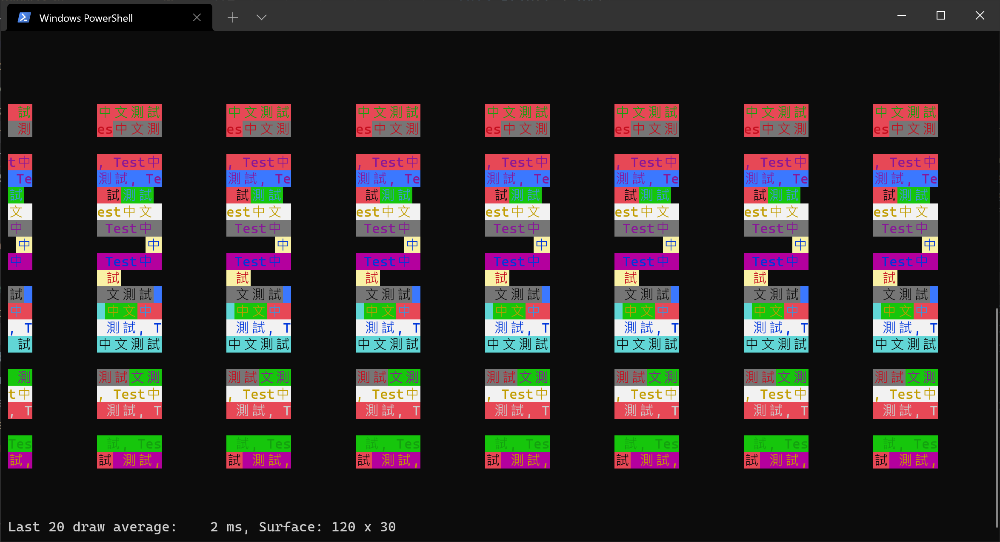
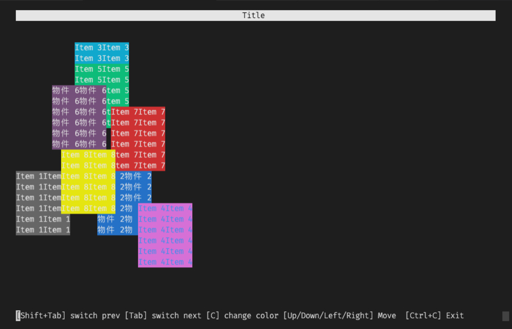
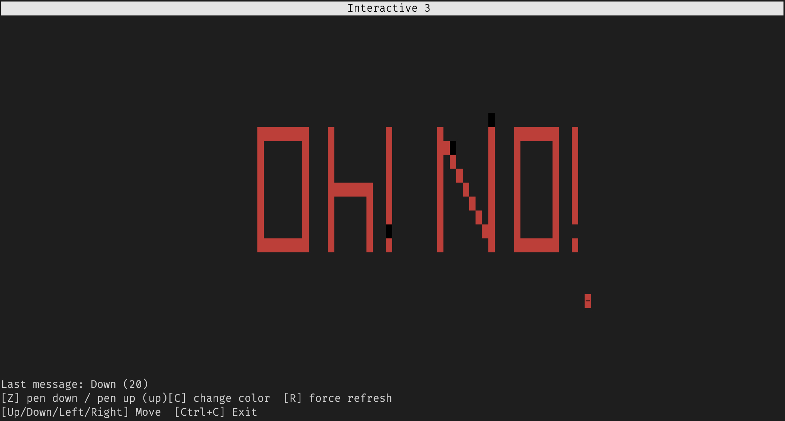

# Terminal Canvas

A lib that tries to implement a canvas2d-like api on terminal.  
Allows user to draw on terminal like a image.

Unlike `blessed`, this library don't have a concept of object tree.  
Nor does it handle things like `scroll position` for you.  
The whole terminal is a big canvas for you to draw in whatever way you like

And also it handles the width issue of double width character for you (for example cjk).

## Mixed spi call example

## Implement a window on the top of it

## Actually treat it as canvas

